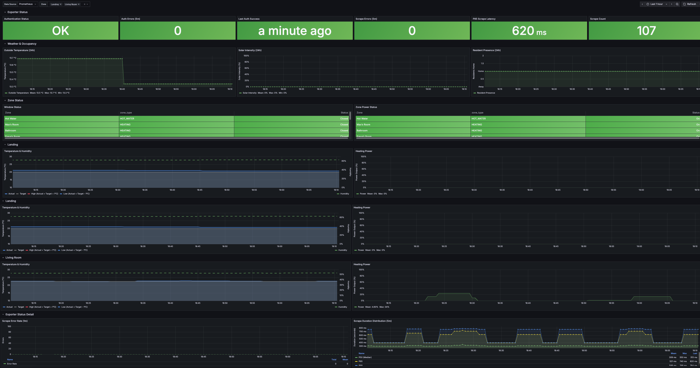

# Tado Prometheus Exporter

[](https://goreportcard.com/report/github.com/andreweacott/tado-prometheus-exporter)
[](https://opensource.org/licenses/MIT)
[](https://hub.docker.com/r/adventuresintech/tado-prometheus-exporter)
[](https://github.com/andreweacott/tado-prometheus-exporter/releases)

Export [Tado](https://www.tado.com/) heating system metrics to Prometheus. Monitor your home's temperature, humidity, heating power, and occupancy with easy setup, encrypted token storage, and no OAuth app registration required.

## Why This Project?

Most other Tado integrations were implemented using a username/password authentication schema that has now been deprecated.  This project uses the [recommended OAuth device code grant flow](https://support.tado.com/en/articles/8565472-how-do-i-authenticate-to-access-the-rest-api) instead. 

- **Low Configuration**: Just provide a passphrase; tokens are encrypted and stored locally
- **(Mostly) Unattended**: First time authentication requires user interaction, then run forever without interaction
- **Built for Homelabs**: Lightweight, designed to run on minimal hardware (Raspberry Pi, Docker, bare metal)

---
### Grafana Dashboard

A pre-built Grafana dashboard is included for monitoring Tado metrics.



[View the example dashboard JSON](docs/examples/dashboards/tado-exporter.json)

---

## Quick Start

### Recommended: Pre-built Docker Image

The easiest way to get started is using the pre-built Docker image from Docker Hub:

```bash
docker run -d \
  --name tado-exporter \
  -p 9100:9100 \
  -v tado-tokens:/root/.tado-exporter \
  -e TADO_TOKEN_PASSPHRASE="your-secure-passphrase" \
  adventuresintech/tado-prometheus-exporter

# Check logs for authentication URL
docker logs tado-exporter
```

**First run**: Visit the URL shown in `docker logs tado-exporter` to authorize with your Tado account. On subsequent runs, authentication is automatic.

Image available at: [`adventuresintech/tado-prometheus-exporter`](https://hub.docker.com/r/adventuresintech/tado-prometheus-exporter)

### Alternative: Docker Compose (with Prometheus & Grafana)

For a complete monitoring stack with Prometheus and Grafana included:

```bash
# Start the full stack
cd local && TADO_TOKEN_PASSPHRASE=your-secret docker-compose up -d

# View logs and authenticate
cd local && docker-compose logs -f exporter

# Access services:
# - Exporter metrics: http://localhost:9100/metrics
# - Prometheus: http://localhost:9090
# - Grafana: http://localhost:3000 (admin/admin)
```

### Alternative: Standalone Binary

For direct installation without Docker:

```bash
# Build from source
git clone https://github.com/andreweacott/tado-prometheus-exporter.git
cd tado-prometheus-exporter
make build

# Run with your passphrase
./tado-exporter --token-passphrase="your-secure-passphrase"

# Follow the authentication prompt
```

---

## Configuration

### Common Options

```bash
./tado-exporter \
  --token-passphrase="your-passphrase" \           # Required
  --port=9100 \                                      # Metrics port (default: 9100)
  --scrape-timeout=10 \                             # API timeout seconds (default: 10)
  --home-id="12345" \                               # Optional: filter to specific home
  --log-level=info                                  # debug|info|warn|error (default: info)
```

### Environment Variables

All flags can be set via environment variables:

```bash
export TADO_TOKEN_PASSPHRASE="your-passphrase"
export TADO_PORT=9100
export TADO_SCRAPE_TIMEOUT=10
export TADO_HOME_ID=12345
export TADO_LOG_LEVEL=info
```

---

## Authentication Flow

**First run** (one-time setup):

1. Start the exporter
2. You'll see:
   ```
   Visit this URL to authenticate:
   https://my.tado.com/authorize?user_code=ABCD-1234
   ```
3. Open the URL in your browser
4. Authorize the exporter with your Tado account
5. Token is encrypted and saved automatically

**Subsequent runs**:
- Exporter loads the encrypted token automatically
- Token is refreshed as needed
- No re-authentication required

---

## Metrics Reference

### Home-Level Metrics

| Metric | Type | Description |
|--------|------|-------------|
| `tado_is_resident_present` | Gauge | Whether anyone is home (1=yes, 0=no) |
| `tado_solar_intensity_percentage` | Gauge | Solar radiation intensity (0-100%) |
| `tado_temperature_outside_celsius` | Gauge | Outside temperature (°C) |
| `tado_temperature_outside_fahrenheit` | Gauge | Outside temperature (°F) |

### Zone-Level Metrics

Labeled with: `home_id`, `zone_id`, `zone_name`, `zone_type`

| Metric | Type | Description |
|--------|------|-------------|
| `tado_temperature_measured_celsius` | Gauge | Current temperature (°C) |
| `tado_temperature_measured_fahrenheit` | Gauge | Current temperature (°F) |
| `tado_humidity_measured_percentage` | Gauge | Humidity (0-100%) |
| `tado_temperature_set_celsius` | Gauge | Target temperature (°C) |
| `tado_temperature_set_fahrenheit` | Gauge | Target temperature (°F) |
| `tado_heating_power_percentage` | Gauge | Heating output (0-100%) |
| `tado_is_window_open` | Gauge | Window open status (1=open, 0=closed) |
| `tado_is_zone_powered` | Gauge | Zone power state (1=on, 0=off) |

### Exporter Health Metrics

| Metric | Type | Description |
|--------|------|-------------|
| `tado_exporter_scrape_duration_seconds` | Histogram | Time to collect metrics (buckets: 0.1s, 0.2s, ..., 3.2s) |
| `tado_exporter_scrape_errors_total` | Counter | Total collection errors |
| `tado_exporter_authentication_valid` | Gauge | Is authentication valid? (1=yes, 0=no) |

---

## Example Prometheus Integration

### Add to `prometheus.yml`:

```yaml
scrape_configs:
  - job_name: 'tado'
    static_configs:
      - targets: ['<exporter_hostname>:9100']
```

### Alerting

The exporter includes some metrics about it's own operation, intended to be used to identify and alert on failure conditions.
Examples can be found in [docs/examples/tado-exporter-rules.yml](./docs/examples/tado-exporter-rules.yml)

---

## Troubleshooting

### Common Issues

**Q: "Device code expired"**
- You have 5 minutes to complete authentication
- Check internet connectivity and try again

**Q: "Token file corrupted or invalid"**
- Verify passphrase is correct
- Check file permissions: `ls -la ~/.tado-exporter/token.json`
- Delete and re-authenticate: `rm ~/.tado-exporter/token.json && docker restart tado-exporter`

**Q: "No metrics returned"**
- Check exporter is running: `curl http://localhost:9100/health`
- Check logs: `docker logs tado-exporter`
- Increase timeout if your network is slow: `--scrape-timeout=30`

**Q: "Prometheus not scraping metrics"**
- Verify Prometheus config has exporter in scrape_configs
- Check Prometheus targets page: http://localhost:9090/targets
- Ensure exporter port (9100) is accessible from Prometheus

---

## Contributing
See the [CONTRIBUTING](CONTRIBUTING.md) guide for details on how to contribute.

---

## License

Licensed under the MIT License. See [LICENSE](LICENSE) file for details.

---

## Support & Community

- 📖 **Documentation**: See [docs/](docs/) for detailed guides
- 🐛 **Issues**: [Report bugs or request features](https://github.com/andreweacott/tado-prometheus-exporter/issues)
- 💬 **Discussions**: [Ask questions or share ideas](https://github.com/andreweacott/tado-prometheus-exporter/discussions)
- ⭐ **Like it?** Consider starring the repository to show your support

---

## Related Projects

- [clambin/tado](https://github.com/clambin/tado) - Tado API Go library
- [Prometheus](https://prometheus.io/) - Monitoring and alerting toolkit
- [Grafana](https://grafana.com/) - Visualization platform

---

## Acknowledgments

- Built with [clambin/tado](https://github.com/clambin/tado) Tado API library
- Follows [Prometheus exporter best practices](https://prometheus.io/docs/practices/instrumentation/)
- Inspired by the homelab community

---

**Made with ❤️ for home automation enthusiasts and homelabs**
